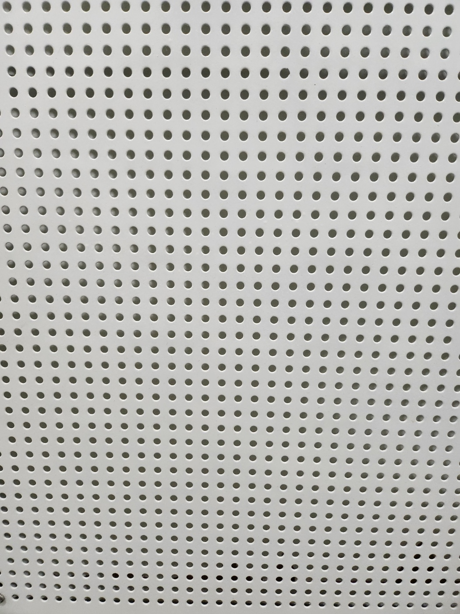
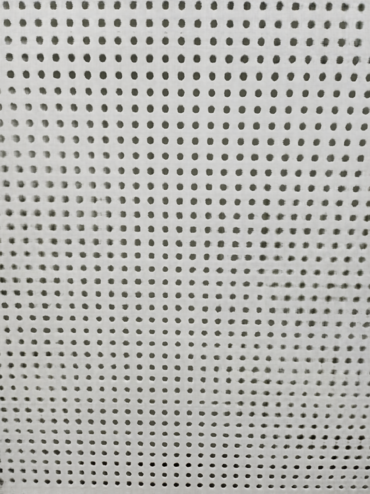
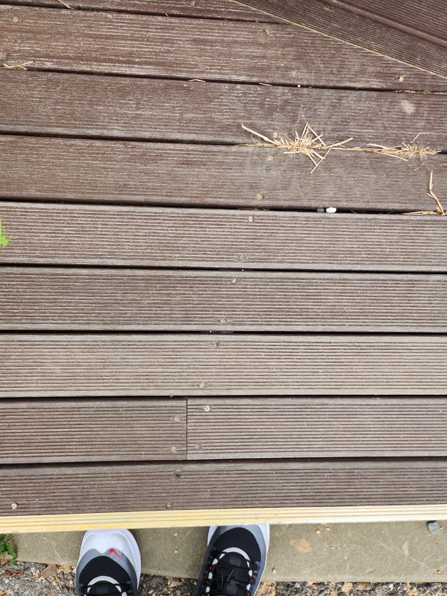
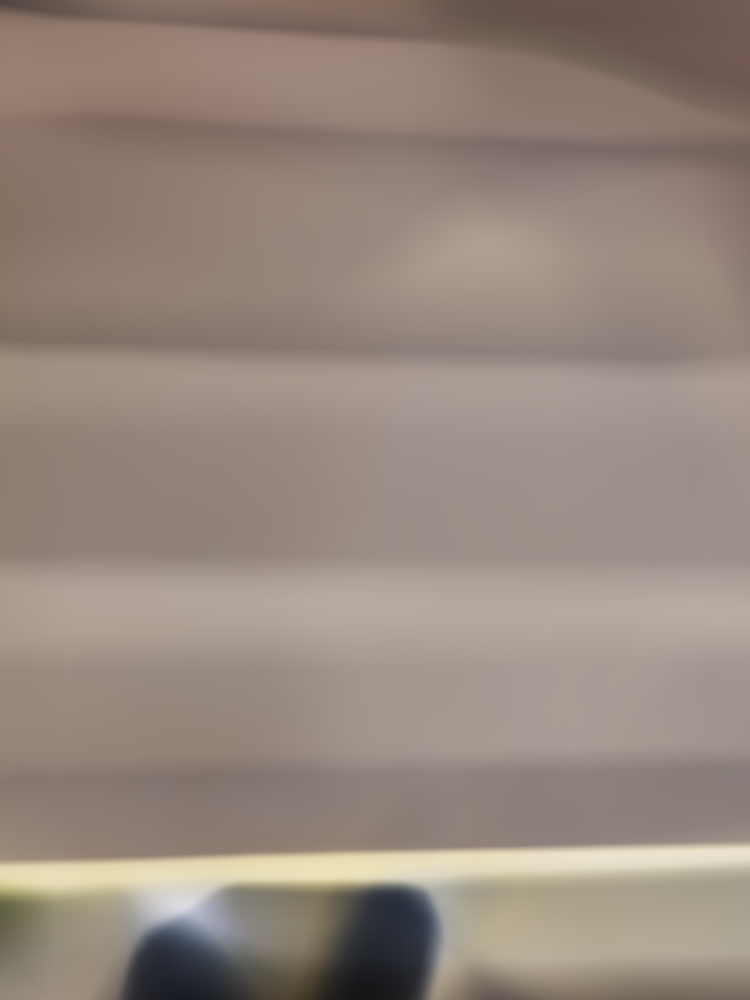
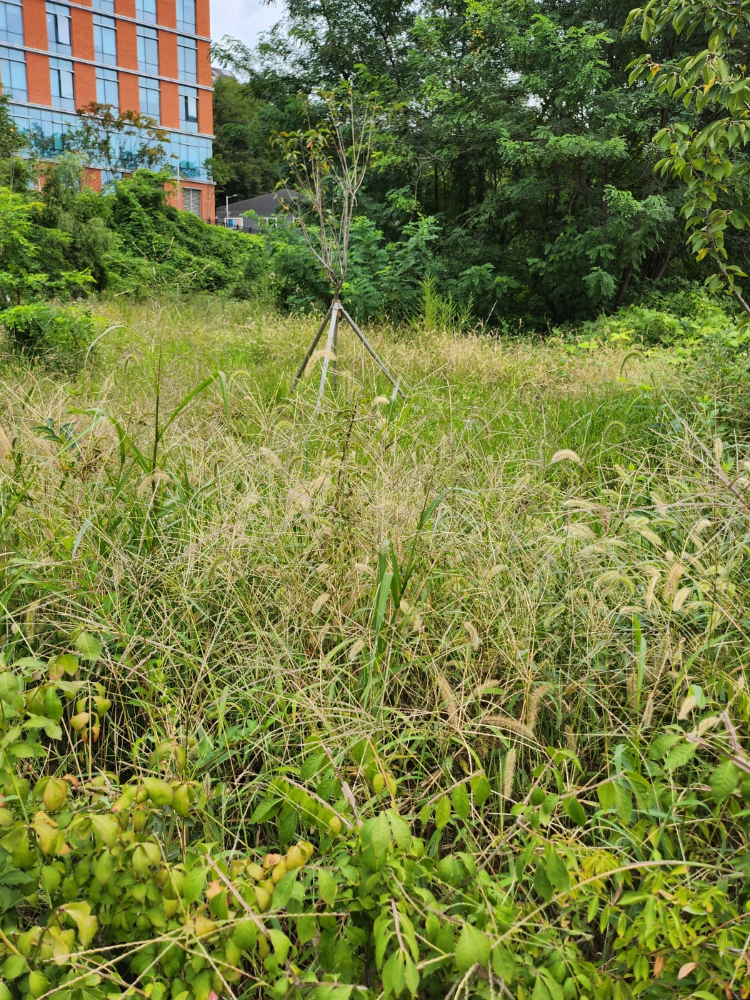
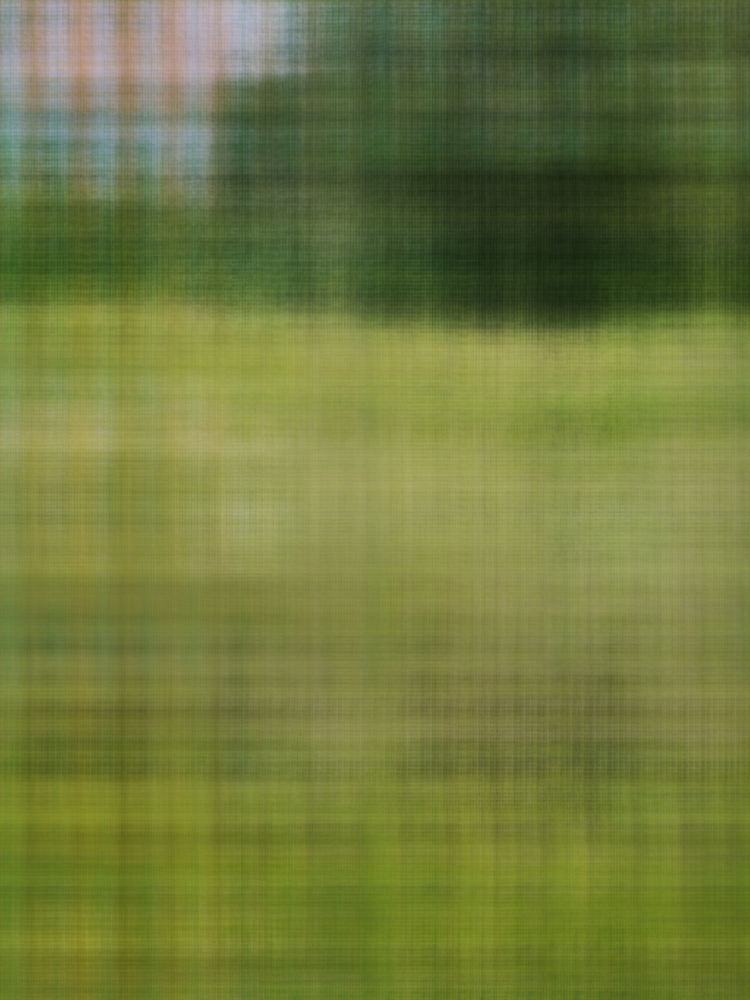
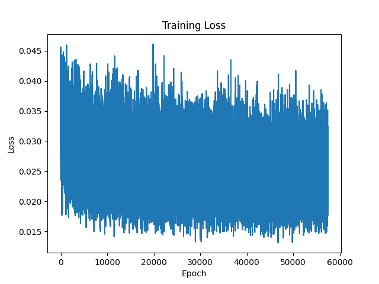

# NERF-vs-QRF

# Task

To  test model reconsturction 2d image by postion input

# HOW TO

```bash
cd NERF-vs-QRF

#use python 3.12.6 version
pip install -r requreiment.txt
cd 2d-image

#revise config.py for set parameter
python3 main.py
```


# Result
## Test 1
|Original|Mlp|Postion|Quantum|
|---|---|---|---|
|||||


## Test 2
|Original|Mlp|Postion|Quantum|
|---|---|---|---|
|||||


## Test 3
|Original|Mlp|Postion|Quantum|
|---|---|---|---|
|||||

## Trainig Loss

|Mlp|Postion|Quantum|
|---|----|---|
||||


